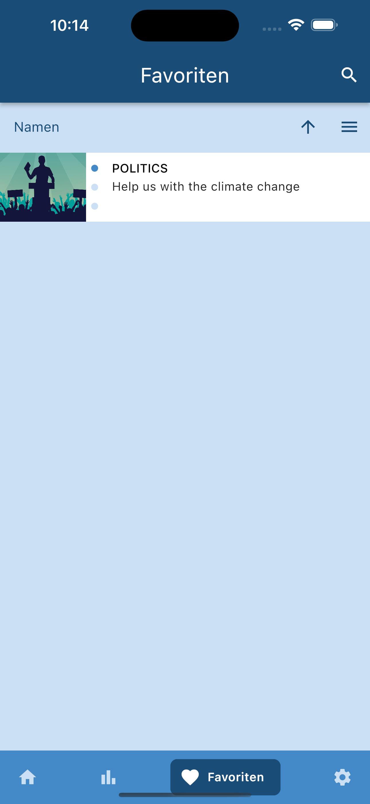

# swp_direktdem_verf_app

<p float="left">
    
    
    
</p>


Eine mobile App mit Flutter für Android und iOS zur Staerkung direktdemokratischer Verfahren.


## Table Of Content

- [Testet with version](#testet-with-version)
- [Run](#run)
- [Example pictures](#example-pictures)


## Testet with version
 - macOS Ventura: 13.2.1
 - android studio: 2022.1.1 
 - Flutter: 3.7.3
 - IPhone 14 iOS: 16.2, iPhone SE1 iOS: 15.7.3
 - When CLI calendar: 1.1.45
 - Xcode 14.2
 - Android SDK Platform-Tools: 34.0.0
 - DevTools: 2.20.1
 - Dart 2.19.2

## Run
```
flutter pub get
flutter run
```

## Example pictures
<p float="left">
    
    
    
    
    
    
    
    
    
    
</p>


## Contribution
- Thore Brehmer (thob97): Home page, dashboard page, procedure page, database connection, mocked database connection, repo maintenance
- Lukas Ludwig: map page
- Carlo Schmitt: new procedure page
- David Ly: QnA page
- Natalja Amiridze: Settings page
- Anastasia Dafni: /